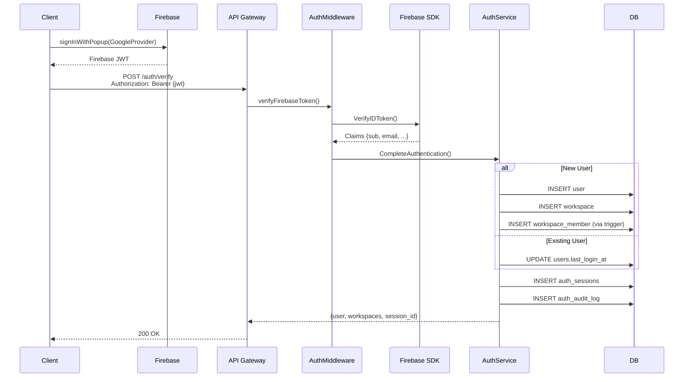

# Authentication Service

Firebase-based authentication service for the Twigger gardening platform, built with Go following domain-driven design principles.

## Features

✅ **Phase 1 Complete** (Foundation)
- Firebase JWT token verification
- User entity with Firebase integration
- Workspace-based multi-tenancy
- Session management
- Comprehensive audit logging
- PostgreSQL repositories with full CRUD
- Unit tests with mocks

## Architecture

```
backend/auth-service/
├── domain/
│   ├── entity/              # Core business objects
│   │   ├── user.go         # User entity with Firebase UID
│   │   ├── workspace.go    # Workspace & membership entities
│   │   ├── session.go      # Session entity
│   │   └── audit_event.go  # Audit log entity
│   ├── repository/          # Repository interfaces
│   │   ├── user_repository.go
│   │   ├── workspace_repository.go
│   │   ├── session_repository.go
│   │   └── audit_repository.go
│   └── service/            # Business logic
│       ├── auth_service.go # Core auth service
│       └── auth_service_test.go
├── infrastructure/
│   └── persistence/        # PostgreSQL implementations
│       ├── postgres_user_repository.go
│       ├── postgres_workspace_repository.go
│       ├── postgres_session_repository.go
│       └── postgres_audit_repository.go
└── docs/
    ├── architecture.md     # Technical architecture
    ├── prd.md             # Product requirements
    ├── tasks.md           # Implementation tasks
    └── SETUP.md           # Setup guide
```

## Database Schema

### Extended Tables
- **users**: Added `firebase_uid`, `email_verified`, `phone_number`, `photo_url`, `provider`, `last_login_at`, `deleted_at`, `preferred_language_id`, `country_id`

### New Tables
- **workspaces**: Multi-tenant workspaces
- **workspace_members**: Role-based workspace membership (admin, member, viewer)
- **auth_sessions**: Session tracking for audit and revocation
- **auth_audit_log**: Partitioned audit log (by month)
- **linked_accounts**: Social provider account linking

See migration: `migrations/008_add_auth_and_workspaces.up.sql`

## Quick Start

### 1. Start Services

```bash
# Start PostgreSQL, Firebase Emulator, Redis
docker-compose up -d
```

### 2. Run Migration

```bash
go run cmd/migrate/main.go up
```

### 3. Configure Environment

```bash
# .env
AUTH_ENABLED=false  # Bypass auth for development
DB_HOST=localhost
DB_PORT=5432
DB_USER=postgres
DB_PASSWORD=postgres
DB_NAME=twigger
```

### 4. Run Tests

```bash
# Unit tests
go test ./backend/auth-service/...

# With coverage
go test -cover ./backend/auth-service/...
```

## Key Components

### AuthService

The core service handling authentication logic:

```go
// Complete authentication after Firebase verifies JWT
response, err := authService.CompleteAuthentication(
    ctx,
    firebaseUID,
    email,
    provider,
    emailVerified,
    photoURL,
    deviceID,
    ipAddress,
    userAgent,
)

// Returns:
// - User entity
// - List of user's workspaces
// - Session ID
// - IsNewUser flag
```

**New User Flow**:
1. Create user record
2. Create default workspace: `{username}'s Garden`
3. Add user as workspace admin (via trigger)
4. Create session
5. Log registration event

**Existing User Flow**:
1. Update `last_login_at`
2. Load user workspaces
3. Create session
4. Log login event

### Repositories

All repositories follow the same pattern:

```go
// Create
err := userRepo.Create(ctx, user)

// Read
user, err := userRepo.GetByID(ctx, userID)
user, err := userRepo.GetByFirebaseUID(ctx, firebaseUID)
user, err := userRepo.GetByEmail(ctx, email)

// Update
err := userRepo.Update(ctx, user)
err := userRepo.UpdateLastLogin(ctx, userID)

// Delete (soft)
err := userRepo.SoftDelete(ctx, userID)
```

## Authentication Flow



## Testing

### Unit Tests

Mocked repositories for fast testing:

```go
func TestCompleteAuthentication_NewUser(t *testing.T) {
    userRepo := NewMockUserRepository()
    workspaceRepo := NewMockWorkspaceRepository()
    sessionRepo := NewMockSessionRepository()
    auditRepo := NewMockAuditRepository()

    service := NewAuthService(userRepo, workspaceRepo, sessionRepo, auditRepo, nil)

    response, err := service.CompleteAuthentication(ctx, ...)

    // Assertions
}
```

### Integration Tests (Coming in Phase 2)

Test against real PostgreSQL database.

## Environment Variables

| Variable | Description | Example |
|----------|-------------|---------|
| `FIREBASE_PROJECT_ID` | Firebase project ID | `twigger-prod` |
| `FIREBASE_CREDENTIALS_PATH` | Service account key path | `/secrets/firebase-admin-key.json` |
| `AUTH_ENABLED` | Enable auth (false for dev) | `true` |
| `DB_HOST` | Database host | `localhost` |
| `DB_PORT` | Database port | `5432` |
| `DB_USER` | Database user | `postgres` |
| `DB_NAME` | Database name | `twigger` |

See [SETUP.md](./docs/SETUP.md) for full configuration.

## Next Steps (Phase 2)

- [ ] Create API handlers (`/api/v1/auth/verify`, `/api/v1/auth/logout`, `/api/v1/auth/me`)
- [ ] Implement real Firebase verification (currently mock)
- [ ] Add session token to response
- [ ] Integration tests with test database
- [ ] Register routes in API Gateway

See [tasks.md](./docs/tasks.md) for detailed roadmap.

## Security Features

**Phase 1**:
- ✅ Firebase JWT validation (mock ready, production TODO)
- ✅ Session tracking for audit
- ✅ Comprehensive audit logging
- ✅ Soft delete for GDPR compliance
- ✅ Workspace isolation

**Phase 4** (Upcoming):
- Rate limiting (100 req/min per IP)
- Suspicious activity detection
- Account lockout after failed attempts
- Redis caching for performance

## Performance Targets

| Operation | Target (p95) |
|-----------|-------------|
| Token verification | < 50ms |
| User lookup | < 20ms |
| Complete auth (existing) | < 100ms |
| Complete auth (new user) | < 300ms |

## Contributing

Follow existing patterns:

1. **Entities**: Pure Go structs, no business logic
2. **Repositories**: Interface in `domain/repository`, implementation in `infrastructure/persistence`
3. **Services**: Business logic in `domain/service`
4. **Tests**: Unit tests with mocks, integration tests with real DB
5. **Error Handling**: Always wrap errors with context

## Documentation

- [Architecture](./docs/architecture.md) - Technical design
- [PRD](./docs/prd.md) - Product requirements
- [Tasks](./docs/tasks.md) - Implementation roadmap
- [Setup](./docs/SETUP.md) - Setup and configuration
- [CLAUDE.md](../../CLAUDE.md) - Coding standards

## License

Proprietary - Twigger Platform

---

**Status**: Phase 1 Complete ✅
**Last Updated**: 2025-01-27
**Version**: 2.0
