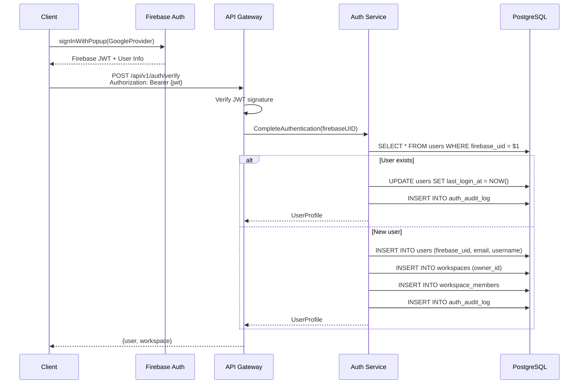
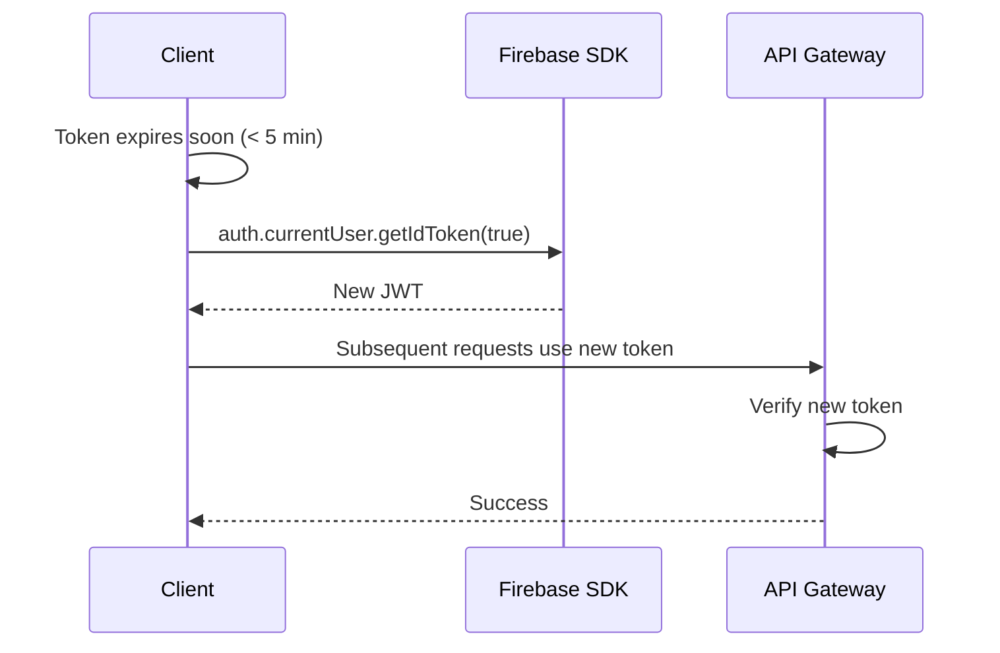
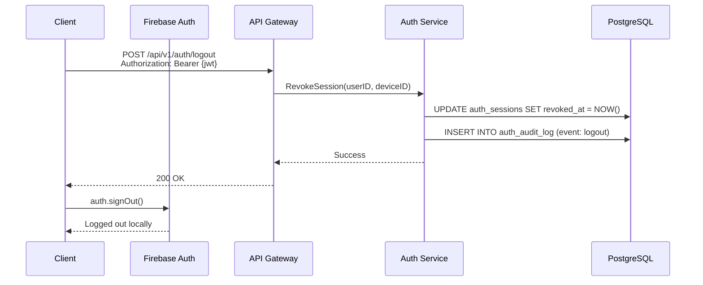

# Authentication Service Architecture
**Version:** 2.0 (Aligned with Twigger System Architecture)
**Date:** 2025-01-27
**Status:** Draft

---

## 1. System Overview

The authentication service is a **lightweight Go-based service** that integrates Firebase Authentication for token validation and manages user identity within the Twigger platform's workspace-based multi-tenant architecture. This service is designed to scale with the existing PostgreSQL infrastructure and align with the established domain-driven design patterns.

### Key Design Principles
- **Go-Native**: Built with Go 1.22+ matching existing service architecture
- **Firebase Token Validation**: Lightweight integration for JWT verification only (no Admin SDK sync)
- **Workspace Integration**: Maps Firebase users to workspace members seamlessly
- **Minimal Database Footprint**: Extends existing `users` table, no parallel user management
- **DDD Alignment**: Follows established `entity.go`, `repository.go`, `service.go` patterns
- **Single Database**: Integrates with existing PostgreSQL instance using schema separation
- **Reuse Localization**: Leverages existing 8-table localization system with 4-tier fallback

---

## 2. High-Level Architecture

```
┌─────────────────────────────────────────────────────────────┐
│                         Clients                              │
│  ┌──────────┐     ┌──────────┐     ┌──────────┐            │
│  │   iOS    │     │ Android  │     │   Web    │            │
│  │ Flutter  │     │ Flutter  │     │ Flutter  │            │
│  └────┬─────┘     └────┬─────┘     └────┬─────┘            │
└───────┼────────────────┼────────────────┼───────────────────┘
        │                │                │
        └────────────────┼────────────────┘
                    HTTPS (TLS 1.3)
                         │
┌────────────────────────┼──────────────────────────────────────┐
│                   API Gateway (Go)                             │
│  ┌──────────────────────────────────────────────┐            │
│  │         Auth Middleware (Existing)            │            │
│  │  • JWT Token Validation (Firebase)            │            │
│  │  • User Context Extraction (sub claim)        │            │
│  │  • Request Propagation                        │            │
│  └──────────────────────────────────────────────┘            │
└────────────────────────┼──────────────────────────────────────┘
                         │
┌────────────────────────┼──────────────────────────────────────┐
│             Auth Service Domain (Go)                           │
│  ┌────────────────────────────────────────────────────────┐  │
│  │  internal/auth-service/                                 │  │
│  │    ├── domain/                                          │  │
│  │    │   ├── entity/                                      │  │
│  │    │   │   ├── user.go                                  │  │
│  │    │   │   └── session.go                               │  │
│  │    │   ├── repository/                                  │  │
│  │    │   │   ├── user_repository.go (interface)           │  │
│  │    │   │   └── session_repository.go (interface)        │  │
│  │    │   └── service/                                     │  │
│  │    │       ├── auth_service.go                          │  │
│  │    │       └── session_service.go                       │  │
│  │    ├── infrastructure/                                  │  │
│  │    │   └── persistence/                                 │  │
│  │    │       ├── postgres_user_repository.go              │  │
│  │    │       └── postgres_session_repository.go           │  │
│  │    └── handlers/                                        │  │
│  │        └── auth_handler.go                              │  │
│  └────────────────────────────────────────────────────────┘  │
└────────────────────────┼──────────────────────────────────────┘
                         │
┌────────────────────────┼──────────────────────────────────────┐
│                 External Services                              │
│  ┌──────────────────────────────────────────────┐            │
│  │         Firebase Authentication               │            │
│  │  • Public Key Endpoint (Token Verification)   │            │
│  │  • OAuth Provider Management (Google, etc)    │            │
│  │  • Client SDK Support                         │            │
│  └──────────────────────────────────────────────┘            │
└────────────────────────────────────────────────────────────────┘
                         │
┌────────────────────────┼──────────────────────────────────────┐
│              PostgreSQL 17 + PostGIS                           │
│  ┌──────────────────────────────────────────────┐            │
│  │  Existing Tables (Extends):                   │            │
│  │    • users (firebase_uid added)               │            │
│  │    • workspaces (unchanged)                   │            │
│  │    • workspace_members (unchanged)            │            │
│  │                                                │            │
│  │  New Tables (Auth-specific):                  │            │
│  │    • auth_sessions                            │            │
│  │    • auth_audit_log (partitioned)             │            │
│  │    • password_reset_tokens                    │            │
│  │    • linked_accounts                          │            │
│  └──────────────────────────────────────────────┘            │
└────────────────────────────────────────────────────────────────┘
```

---

## 3. Component Architecture

### 3.1 API Gateway Integration (Existing)

The authentication middleware already exists in `internal/api-gateway/middleware/auth.go`:

```go
// Current implementation (to be enhanced)
type AuthMiddleware struct {
    projectID string
    enabled   bool
}

// RequireAuth validates Firebase JWT and sets user context
func (m *AuthMiddleware) RequireAuth(next http.Handler) http.Handler {
    // Extracts "Authorization: Bearer <token>"
    // Verifies Firebase JWT (currently mock, needs Firebase SDK)
    // Sets user ID in context: utils.SetUserID(ctx, userID)
    // Propagates language context if available
}
```

**Enhancement Needed:**
```go
// Add Firebase token verification
import (
    firebase "firebase.google.com/go/v4"
    "firebase.google.com/go/v4/auth"
)

func (m *AuthMiddleware) verifyFirebaseToken(ctx context.Context, token string) (*auth.Token, error) {
    app, err := firebase.NewApp(ctx, nil)
    if err != nil {
        return nil, fmt.Errorf("firebase init: %w", err)
    }

    client, err := app.Auth(ctx)
    if err != nil {
        return nil, fmt.Errorf("firebase auth client: %w", err)
    }

    return client.VerifyIDToken(ctx, token)
}
```

### 3.2 Auth Service Domain Structure

```
backend/auth-service/
├── domain/
│   ├── entity/
│   │   ├── user.go              # User entity (maps to users table)
│   │   ├── session.go           # Session entity
│   │   └── audit_event.go       # Audit log entity
│   ├── repository/
│   │   ├── user_repository.go   # Interface definition
│   │   └── session_repository.go
│   └── service/
│       ├── auth_service.go      # Core auth business logic
│       └── session_service.go   # Session management
├── infrastructure/
│   └── persistence/
│       ├── postgres_user_repository.go
│       └── postgres_session_repository.go
└── docs/
    ├── prd.md
    └── architecture.md (this file)
```

### 3.3 Database Schema Extensions

**Extend Existing `users` Table:**
```sql
-- Migration: 008_add_auth_fields.up.sql
ALTER TABLE users
ADD COLUMN firebase_uid VARCHAR(128) UNIQUE,
ADD COLUMN email_verified BOOLEAN DEFAULT FALSE,
ADD COLUMN phone_number VARCHAR(20),
ADD COLUMN photo_url TEXT,
ADD COLUMN provider VARCHAR(50), -- 'email', 'google.com', 'facebook.com', 'apple.com'
ADD COLUMN last_login_at TIMESTAMPTZ,
ADD COLUMN deleted_at TIMESTAMPTZ;

CREATE INDEX idx_users_firebase_uid ON users(firebase_uid) WHERE firebase_uid IS NOT NULL;
CREATE INDEX idx_users_deleted_at ON users(deleted_at) WHERE deleted_at IS NOT NULL;
```

**New Auth-Specific Tables:**
```sql
-- Sessions table (refresh token management)
CREATE TABLE auth_sessions (
    session_id UUID DEFAULT uuid_generate_v4() PRIMARY KEY,
    user_id UUID NOT NULL REFERENCES users(user_id) ON DELETE CASCADE,
    refresh_token_hash VARCHAR(255) UNIQUE NOT NULL,
    device_id VARCHAR(255),
    device_info JSONB,
    ip_address INET,
    user_agent TEXT,
    created_at TIMESTAMPTZ DEFAULT CURRENT_TIMESTAMP,
    expires_at TIMESTAMPTZ NOT NULL,
    revoked_at TIMESTAMPTZ,

    INDEX idx_sessions_user_id (user_id),
    INDEX idx_sessions_expires_at (expires_at),
    INDEX idx_sessions_token_hash (refresh_token_hash)
);

-- Audit log table (partitioned by month)
CREATE TABLE auth_audit_log (
    id BIGSERIAL PRIMARY KEY,
    user_id UUID REFERENCES users(user_id),
    event_type VARCHAR(50) NOT NULL, -- 'login', 'logout', 'register', 'token_refresh'
    success BOOLEAN NOT NULL,
    ip_address INET,
    user_agent TEXT,
    metadata JSONB DEFAULT '{}',
    created_at TIMESTAMPTZ DEFAULT CURRENT_TIMESTAMP,

    INDEX idx_audit_user_id (user_id),
    INDEX idx_audit_created_at (created_at),
    INDEX idx_audit_event_type (event_type)
) PARTITION BY RANGE (created_at);

-- Create first partition
CREATE TABLE auth_audit_log_2025_01 PARTITION OF auth_audit_log
    FOR VALUES FROM ('2025-01-01') TO ('2025-02-01');

-- Linked accounts (social login)
CREATE TABLE linked_accounts (
    id UUID DEFAULT uuid_generate_v4() PRIMARY KEY,
    user_id UUID NOT NULL REFERENCES users(user_id) ON DELETE CASCADE,
    provider VARCHAR(50) NOT NULL, -- 'google.com', 'facebook.com', 'apple.com'
    provider_user_id VARCHAR(255) NOT NULL,
    linked_at TIMESTAMPTZ DEFAULT CURRENT_TIMESTAMP,

    UNIQUE(provider, provider_user_id)
);

-- Password reset tokens (if implementing email/password)
CREATE TABLE password_reset_tokens (
    id UUID DEFAULT uuid_generate_v4() PRIMARY KEY,
    user_id UUID NOT NULL REFERENCES users(user_id) ON DELETE CASCADE,
    token_hash VARCHAR(255) UNIQUE NOT NULL,
    expires_at TIMESTAMPTZ NOT NULL,
    used_at TIMESTAMPTZ,
    created_at TIMESTAMPTZ DEFAULT CURRENT_TIMESTAMP
);
```

---

## 4. Authentication Flows

### 4.1 Social Login Flow (Primary)



### 4.2 Token Refresh Flow



### 4.3 Logout Flow



---

## 5. Domain-Driven Design Implementation

### 5.1 Entity Layer

```go
// backend/auth-service/domain/entity/user.go
package entity

import (
    "time"
    "github.com/google/uuid"
)

type User struct {
    UserID          uuid.UUID
    FirebaseUID     *string    // Maps to Firebase Auth UID
    Email           string
    Username        string
    EmailVerified   bool
    PhoneNumber     *string
    PhotoURL        *string
    Provider        string     // 'google.com', 'apple.com', etc.

    // Localization (reuses existing system)
    PreferredLanguageID uuid.UUID
    CountryID           *uuid.UUID

    // Spatial (existing field)
    Location        *[]byte    // geography(Point, 4326)

    // Timestamps
    CreatedAt       time.Time
    LastLoginAt     *time.Time
    DeletedAt       *time.Time
}

// Session entity
type Session struct {
    SessionID        uuid.UUID
    UserID           uuid.UUID
    RefreshTokenHash string
    DeviceID         *string
    DeviceInfo       map[string]interface{}
    IPAddress        string
    UserAgent        string
    CreatedAt        time.Time
    ExpiresAt        time.Time
    RevokedAt        *time.Time
}
```

### 5.2 Repository Layer

```go
// backend/auth-service/domain/repository/user_repository.go
package repository

import (
    "context"
    "twigger-backend/backend/auth-service/domain/entity"
    "github.com/google/uuid"
)

type UserRepository interface {
    // Core CRUD
    Create(ctx context.Context, user *entity.User) error
    GetByID(ctx context.Context, userID uuid.UUID) (*entity.User, error)
    GetByFirebaseUID(ctx context.Context, firebaseUID string) (*entity.User, error)
    GetByEmail(ctx context.Context, email string) (*entity.User, error)
    Update(ctx context.Context, user *entity.User) error
    SoftDelete(ctx context.Context, userID uuid.UUID) error

    // Auth-specific
    UpdateLastLogin(ctx context.Context, userID uuid.UUID) error
    LinkProvider(ctx context.Context, userID uuid.UUID, provider, providerUserID string) error
}
```

### 5.3 Service Layer

```go
// backend/auth-service/domain/service/auth_service.go
package service

import (
    "context"
    "fmt"
    "twigger-backend/backend/auth-service/domain/entity"
    "twigger-backend/backend/auth-service/domain/repository"
)

type AuthService struct {
    userRepo     repository.UserRepository
    sessionRepo  repository.SessionRepository
    workspaceRepo repository.WorkspaceRepository // From existing system
}

func NewAuthService(
    userRepo repository.UserRepository,
    sessionRepo repository.SessionRepository,
    workspaceRepo repository.WorkspaceRepository,
) *AuthService {
    return &AuthService{
        userRepo:      userRepo,
        sessionRepo:   sessionRepo,
        workspaceRepo: workspaceRepo,
    }
}

// CompleteAuthentication handles post-Firebase auth logic
func (s *AuthService) CompleteAuthentication(ctx context.Context, firebaseUID, email, provider string) (*entity.User, error) {
    // Check if user exists
    user, err := s.userRepo.GetByFirebaseUID(ctx, firebaseUID)
    if err == nil {
        // Existing user - update last login
        if err := s.userRepo.UpdateLastLogin(ctx, user.UserID); err != nil {
            return nil, fmt.Errorf("update last login: %w", err)
        }
        return user, nil
    }

    // New user - create account + workspace
    tx, err := s.beginTx(ctx)
    if err != nil {
        return nil, fmt.Errorf("begin transaction: %w", err)
    }
    defer tx.Rollback()

    // Create user
    user = &entity.User{
        FirebaseUID: &firebaseUID,
        Email:       email,
        Username:    generateUsername(email),
        Provider:    provider,
    }
    if err := s.userRepo.Create(ctx, user); err != nil {
        return nil, fmt.Errorf("create user: %w", err)
    }

    // Create default workspace
    workspace := &entity.Workspace{
        OwnerID: user.UserID,
        Name:    fmt.Sprintf("%s's Garden", user.Username),
    }
    if err := s.workspaceRepo.Create(ctx, workspace); err != nil {
        return nil, fmt.Errorf("create workspace: %w", err)
    }

    // Add user as workspace admin
    member := &entity.WorkspaceMember{
        WorkspaceID: workspace.WorkspaceID,
        UserID:      user.UserID,
        Role:        "admin",
    }
    if err := s.workspaceRepo.AddMember(ctx, member); err != nil {
        return nil, fmt.Errorf("add workspace member: %w", err)
    }

    if err := tx.Commit(); err != nil {
        return nil, fmt.Errorf("commit transaction: %w", err)
    }

    return user, nil
}
```

---

## 6. Security Architecture

### 6.1 Token Validation Strategy

**Firebase JWT Validation:**
- Public key endpoint: `https://www.googleapis.com/robot/v1/metadata/x509/securetoken@system.gserviceaccount.com`
- Claims validation: `aud`, `iss`, `exp`, `sub`
- No Firebase Admin SDK required for basic validation
- Caching of public keys (4-hour TTL)

**Token Claims:**
```json
{
  "sub": "firebase-user-id",
  "iss": "https://securetoken.google.com/twigger",
  "aud": "twigger",
  "auth_time": 1706370000,
  "exp": 1706373600,
  "iat": 1706370000,
  "email": "user@example.com",
  "email_verified": true,
  "firebase": {
    "identities": {
      "google.com": ["123456789"],
      "email": ["user@example.com"]
    },
    "sign_in_provider": "google.com"
  }
}
```

### 6.2 Session Management

**Session Strategy:**
- Firebase handles JWT lifecycle (15-min access token, 30-day refresh)
- Backend tracks sessions for audit and revocation only
- No custom refresh token implementation needed

**Security Measures:**
- Rate limiting: 100 req/min per IP at gateway
- Suspicious activity detection: Login from new country triggers email
- Account lockout: After 5 failed verification attempts
- Audit logging: All auth events logged with IP/user agent

### 6.3 Data Security

**Encryption:**
- At rest: Cloud SQL automatic encryption (AES-256)
- In transit: TLS 1.3 for all connections
- Sensitive fields: Use pgcrypto for additional column encryption if needed

**Access Control:**
- Workspace isolation: All queries filtered by workspace_id
- Row-level security (RLS): Planned for future implementation
- API Gateway: All requests validated before reaching services

---

## 7. Integration with Existing Systems

### 7.1 Localization Integration

**Reuse Existing System:**
```go
// Auth service uses existing localization patterns
func (s *AuthService) GetLocalizedWelcomeMessage(ctx context.Context, user *entity.User) (string, error) {
    // Leverage existing language fallback chain:
    // 1. User's preferred_language + country
    // 2. User's preferred_language (global)
    // 3. English
    // 4. Key fallback

    return s.localizationService.Translate(ctx, "auth.welcome", user.PreferredLanguageID, user.CountryID)
}
```

**Email Templates:**
- Store in existing `localized_content` table (if exists)
- Or use Go templates with localized strings
- Follow existing 4-tier fallback pattern

### 7.2 Workspace Integration

**Existing Workspace Model:**
```sql
-- From migrations (assumed structure based on references)
CREATE TABLE workspaces (
    workspace_id UUID PRIMARY KEY,
    owner_id UUID NOT NULL REFERENCES users(user_id),
    name VARCHAR(200) NOT NULL,
    created_at TIMESTAMPTZ DEFAULT CURRENT_TIMESTAMP
);

CREATE TABLE workspace_members (
    workspace_id UUID REFERENCES workspaces(workspace_id),
    user_id UUID REFERENCES users(user_id),
    role VARCHAR(50) NOT NULL, -- 'admin', 'member', 'viewer'
    joined_at TIMESTAMPTZ DEFAULT CURRENT_TIMESTAMP,
    PRIMARY KEY (workspace_id, user_id)
);
```

**Auth Service Integration:**
- On new user registration: Create default workspace
- On user login: Load workspace memberships
- Context propagation: Include workspace_id in request context

### 7.3 API Gateway Context Propagation

```go
// Enhanced context utilities
type RequestContext struct {
    UserID      uuid.UUID
    WorkspaceID *uuid.UUID
    Language    *LanguageContext
    SessionID   *uuid.UUID
}

// Middleware sets full context
func (m *AuthMiddleware) RequireAuth(next http.Handler) http.Handler {
    return http.HandlerFunc(func(w http.ResponseWriter, r *http.Request) {
        // Verify token
        token, err := m.verifyFirebaseToken(r.Context(), extractToken(r))

        // Get user from database
        user, err := m.authService.GetByFirebaseUID(token.UID)

        // Get active workspace (from query param, header, or default)
        workspace := m.getActiveWorkspace(r, user.UserID)

        // Set full context
        ctx := utils.SetRequestContext(r.Context(), &RequestContext{
            UserID:      user.UserID,
            WorkspaceID: workspace.WorkspaceID,
            Language:    user.LanguageContext,
        })

        next.ServeHTTP(w, r.WithContext(ctx))
    })
}
```

---

## 8. Performance and Scalability

### 8.1 Performance Targets

| Operation | Target | Measurement |
|-----------|--------|-------------|
| Token Verification | < 50ms | p95 |
| User Lookup (by firebase_uid) | < 20ms | p95 |
| Complete Authentication (existing user) | < 100ms | p95 |
| Complete Authentication (new user) | < 300ms | p95 (includes workspace creation) |

### 8.2 Caching Strategy

**Firebase Public Keys:**
- Cache public keys for 4 hours (per Firebase documentation)
- In-memory cache with sync.Map

**User Lookups:**
- Redis cache (planned): `user:firebase:{uid}` → User JSON
- TTL: 5 minutes
- Invalidation: On user update

**Session Validation:**
- Redis cache: `session:{session_id}` → Valid/Revoked
- TTL: Match session expiration

### 8.3 Database Optimization

**Indexes (Added in migration 008):**
```sql
CREATE INDEX idx_users_firebase_uid ON users(firebase_uid);
CREATE INDEX idx_auth_sessions_user_id ON auth_sessions(user_id);
CREATE INDEX idx_auth_sessions_token_hash ON auth_sessions(refresh_token_hash);
CREATE INDEX idx_audit_user_id ON auth_audit_log(user_id);
CREATE INDEX idx_audit_created_at ON auth_audit_log(created_at);
```

**Connection Pooling (Existing):**
- Max open connections: 25
- Max idle connections: 5
- Connection max lifetime: 5 minutes

---

## 9. Monitoring and Observability

### 9.1 Key Metrics

**Application Metrics:**
- Authentication success/failure rates
- Token verification latency
- User registration rate
- Active sessions count
- Provider distribution (Google vs Apple vs Email)

**Infrastructure Metrics:**
- Database connection pool utilization
- API Gateway request rate
- Error rates by endpoint
- Firebase API call latency

### 9.2 Logging Strategy

**Structured Logging:**
```go
log.Info("authentication_complete",
    zap.String("user_id", user.UserID.String()),
    zap.String("provider", user.Provider),
    zap.String("ip", ipAddress),
    zap.Duration("duration", time.Since(start)),
)
```

**Audit Logging:**
- All auth events logged to `auth_audit_log` table
- Partitioned by month for performance
- Includes: user_id, event_type, success, IP, user agent, metadata

### 9.3 Alerting

**Critical Alerts:**
- Firebase token verification failures > 5% → Page on-call
- Database connection pool exhausted → Page on-call
- Authentication latency > 500ms (p95) → Slack alert

**Warning Alerts:**
- Failed login attempts from single IP > 10/minute → Slack alert
- New user registration spike (> 2x baseline) → Slack alert

---

## 10. Deployment Architecture

### 10.1 Development Environment

**Local Setup:**
```yaml
# docker-compose.yml (extends existing)
services:
  postgres:
    # Existing PostgreSQL 17 + PostGIS

  firebase-emulator:
    image: firebase/emulator
    ports:
      - "9099:9099"  # Auth emulator
    environment:
      - FIREBASE_PROJECT_ID=twigger-dev
```

### 10.2 Production Deployment

**Infrastructure (Aligned with Existing):**
- **Compute**: Google Cloud Run (same as other services)
- **Database**: Existing Cloud SQL PostgreSQL instance
- **Secrets**: Google Secret Manager
- **Monitoring**: Cloud Logging + Cloud Monitoring

**Deployment Strategy:**
- Blue-green deployment
- Database migrations run before deployment
- Health check endpoint: `/health`

---

## 11. Migration Strategy

### Phase 1: Foundation (Week 1-2)
- ✅ Implement Firebase token verification in existing middleware
- ✅ Create migration 008 (add auth fields to users table)
- ✅ Create auth service domain structure (entity, repository, service)
- ✅ Implement basic user lookup by firebase_uid

### Phase 2: Complete Authentication Flow (Week 3-4)
- ✅ Implement CompleteAuthentication service method
- ✅ Add workspace creation on new user registration
- ✅ Create auth_sessions and auth_audit_log tables
- ✅ Implement session management
- ✅ Add audit logging

### Phase 3: Social Providers (Week 5-6)
- ✅ Configure Firebase OAuth providers (Google, Apple, Facebook)
- ✅ Test provider-specific flows
- ✅ Implement linked_accounts table
- ✅ Add provider-specific user attributes

### Phase 4: Production Readiness (Week 7-8)
- ✅ Add Redis caching layer
- ✅ Implement rate limiting
- ✅ Security audit
- ✅ Load testing
- ✅ Documentation completion

---

## 12. API Specifications

### 12.1 Authentication Endpoints

**POST /api/v1/auth/verify**
```yaml
description: Verify Firebase JWT and complete backend authentication
headers:
  Authorization: Bearer {firebase-jwt}
response:
  200:
    body:
      user:
        user_id: uuid
        email: string
        username: string
        preferred_language_id: uuid
      workspace:
        workspace_id: uuid
        name: string
        role: string
  401:
    error: "Invalid token"
```

**POST /api/v1/auth/logout**
```yaml
description: Logout and revoke session
headers:
  Authorization: Bearer {firebase-jwt}
body:
  device_id?: string
response:
  200:
    message: "Logged out successfully"
```

**GET /api/v1/auth/me**
```yaml
description: Get current user profile
headers:
  Authorization: Bearer {firebase-jwt}
response:
  200:
    body:
      user: User
      workspaces: Workspace[]
```

---

## 13. Security Considerations

### 13.1 OWASP Top 10 Compliance

**A01: Broken Access Control**
- Workspace-based isolation enforced at query level
- User context required for all authenticated endpoints

**A02: Cryptographic Failures**
- TLS 1.3 for all connections
- Cloud SQL encryption at rest
- No sensitive data in logs

**A03: Injection**
- Parameterized queries only (no string concatenation)
- Input validation at API boundary

**A07: Authentication Failures**
- Firebase handles authentication
- Rate limiting on verification endpoints
- Account lockout on repeated failures

### 13.2 Data Privacy (GDPR)

**Right to Erasure:**
```go
func (s *AuthService) DeleteUser(ctx context.Context, userID uuid.UUID) error {
    // Soft delete: Set deleted_at timestamp
    // Revoke all sessions
    // Anonymize audit logs (keep for compliance)
    // Schedule hard delete after retention period
}
```

**Data Portability:**
```go
func (s *AuthService) ExportUserData(ctx context.Context, userID uuid.UUID) ([]byte, error) {
    // Export user profile, gardens, plants, etc.
    // Return JSON archive
}
```

---

## 14. Testing Strategy

### 14.1 Unit Tests

```go
// Example: auth_service_test.go
func TestAuthService_CompleteAuthentication_NewUser(t *testing.T) {
    mockUserRepo := mocks.NewMockUserRepository()
    mockWorkspaceRepo := mocks.NewMockWorkspaceRepository()

    service := NewAuthService(mockUserRepo, nil, mockWorkspaceRepo)

    user, err := service.CompleteAuthentication(ctx, "firebase-uid", "test@example.com", "google.com")

    assert.NoError(t, err)
    assert.NotNil(t, user)
    assert.Equal(t, "test@example.com", user.Email)

    // Verify workspace created
    mockWorkspaceRepo.AssertCreateCalled(t)
}
```

### 14.2 Integration Tests

```go
// Example: auth_integration_test.go
// +build integration

func TestCompleteAuthenticationFlow(t *testing.T) {
    // Start test database (PostgreSQL + PostGIS)
    db := setupTestDatabase(t)
    defer db.Close()

    // Run migrations
    runMigrations(db)

    // Create repositories
    userRepo := persistence.NewPostgresUserRepository(db)

    // Test flow
    user, err := authService.CompleteAuthentication(ctx, "test-uid", "test@example.com", "google.com")

    assert.NoError(t, err)

    // Verify user in database
    dbUser, err := userRepo.GetByFirebaseUID(ctx, "test-uid")
    assert.NoError(t, err)
    assert.Equal(t, user.UserID, dbUser.UserID)
}
```

---

## 15. Future Enhancements

### Phase 2 (Post-MVP)
- Multi-factor authentication (Firebase supports TOTP)
- Email verification flows
- Account linking (merge duplicate accounts)
- Social account unlinking

### Phase 3 (Enterprise Features)
- SAML SSO integration
- SCIM user provisioning
- Organization-level authentication policies
- Advanced session management (device management UI)

---

## 16. Documentation References

### Internal Documentation
- System Architecture: `docs/architecture/system-overview.md`
- Development Patterns: `CLAUDE.md`
- Database Schema: `migrations/000001_comprehensive_plant_schema.up.sql`
- Existing Localization: `docs/database/localization-summary.md`

### External Documentation
- [Firebase Auth REST API](https://firebase.google.com/docs/reference/rest/auth)
- [Firebase ID Token Verification](https://firebase.google.com/docs/auth/admin/verify-id-tokens)
- [Go Firebase Admin SDK](https://firebase.google.com/docs/admin/setup#go)
- [PostgreSQL Row-Level Security](https://www.postgresql.org/docs/17/ddl-rowsecurity.html)

---

**Architecture Version**: 2.0 (Aligned with Go-based system)
**Last Updated**: 2025-01-27
**Next Review**: Upon completion of Phase 1
