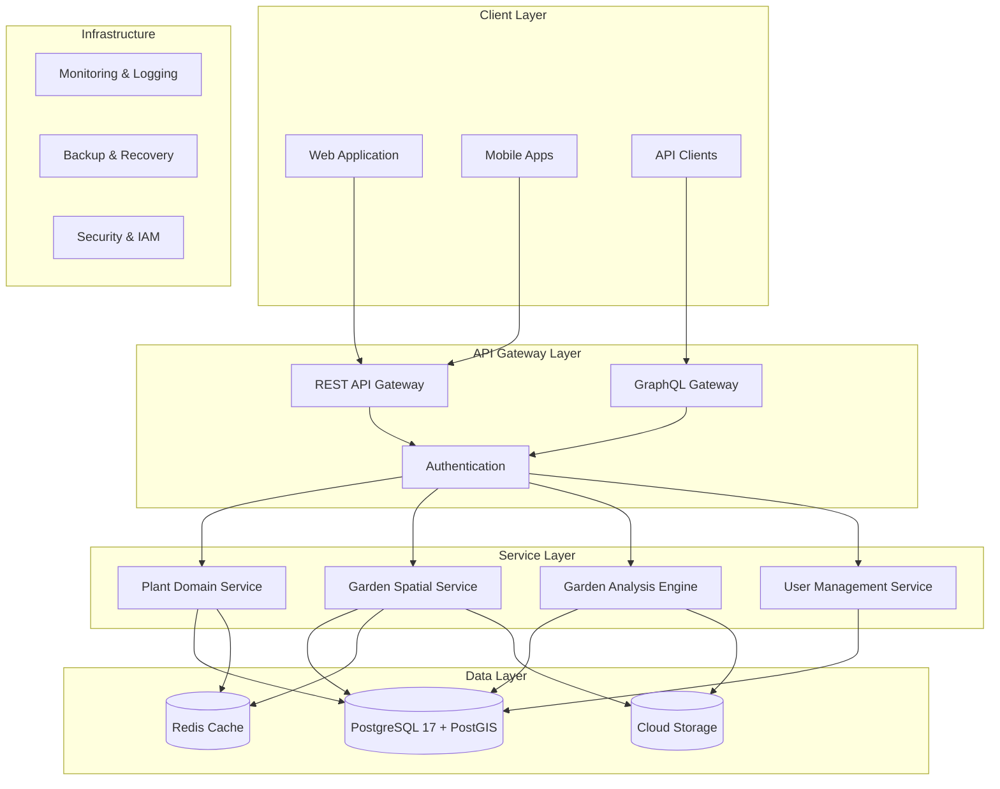
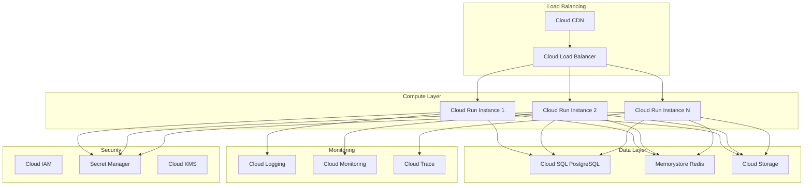
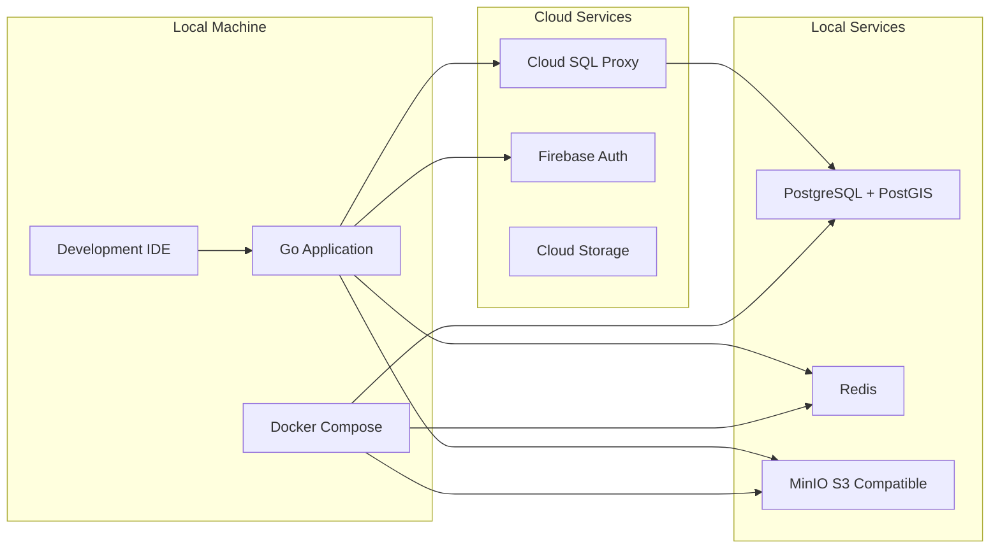
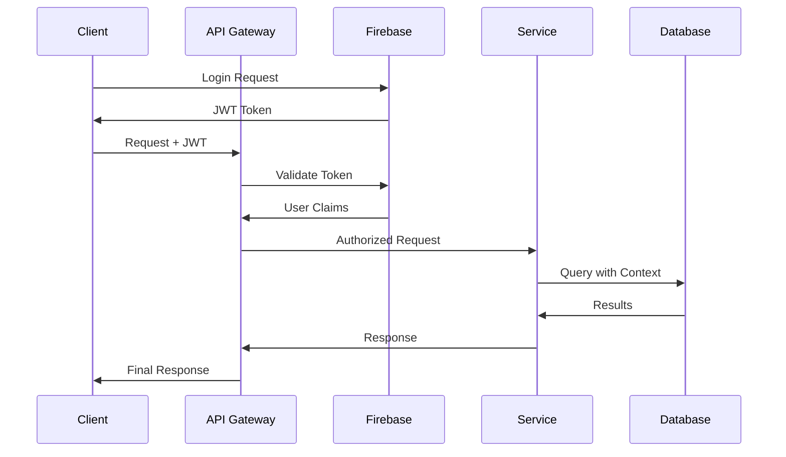

# System Architecture Overview

## Twigger Plant Database Backend System

### High-Level Architecture

The Twigger backend is designed as a modular, scalable system built around a comprehensive plant database with advanced spatial capabilities.

## System Components

### 1. API Gateway Layer

#### REST API Gateway
- **Technology**: Go with Gorilla Mux
- **Purpose**: Lightweight, fast API for mobile and web clients
- **Features**:
  - Request/response validation
  - Rate limiting
  - Request tracing
  - CORS handling
  - Error standardization

#### GraphQL Gateway
- **Technology**: GraphQL with DataLoader
- **Purpose**: Flexible queries for complex client requirements
- **Features**:
  - Schema stitching
  - Query complexity analysis
  - Subscription support
  - Caching integration
  - N+1 query prevention

#### Authentication & Authorization
- **Technology**: Firebase Auth integration
- **Features**:
  - JWT token validation
  - Multi-tenant workspace isolation
  - Role-based access control (RBAC)
  - API key management
  - Audit logging

### 2. Service Layer

#### Plant Domain Service
**Core plant data management and business logic**

**Responsibilities:**
- Plant catalog management
- Scientific name validation
- Growing conditions analysis
- Companion plant relationships
- Multi-source data consensus

**Key Features:**
- Complete taxonomic hierarchy support
- Confidence-based data aggregation
- Full-text search with ranking
- Multilingual plant names
- Data quality scoring

#### Garden Spatial Service
**Spatial garden management with PostGIS integration**

**Responsibilities:**
- Garden boundary management
- Zone and bed creation
- Plant placement tracking
- Spatial relationship queries
- Microclimate analysis

**Key Features:**
- PostGIS spatial operations
- Garden mapping and visualization
- Plant spacing validation
- Zone utilization analysis
- Spatial constraint enforcement

#### Garden Analysis Engine
**Advanced analysis and recommendation system**

**Responsibilities:**
- Shade pattern analysis
- Frost risk assessment
- Drainage analysis
- Plant placement optimization
- Growing condition matching

**Key Features:**
- Solar angle calculations
- Terrain analysis algorithms
- Weather pattern integration
- Machine learning recommendations
- Performance optimization caching

#### User Management Service
**User accounts and workspace management**

**Responsibilities:**
- User profile management
- Workspace administration
- Member invitation and roles
- Subscription tier management
- Location and climate detection

**Key Features:**
- Firebase user synchronization
- Multi-tenant architecture
- Role-based permissions
- Workspace isolation
- Usage analytics

### 3. Data Layer

#### PostgreSQL 17 with PostGIS
**Primary database with spatial capabilities**

**Configuration:**
- Google Cloud SQL managed instance
- PostGIS 3.5 for spatial operations
- Connection pooling with pgxpool
- Automated backups and point-in-time recovery
- Read replicas for scaling

**Key Features:**
- ACID compliance
- Spatial indexing (GIST)
- Full-text search (GIN)
- JSON/JSONB support
- Custom domains and types

#### Redis Cache
**High-performance caching layer**

**Use Cases:**
- Plant search result caching
- Frequently accessed growing conditions
- User session management
- Analysis result caching
- Rate limiting counters

#### Cloud Storage
**File and media storage**

**Contents:**
- Garden photos and images
- Analysis result visualizations
- Export files and reports
- Backup archives
- Static assets

## Deployment Architecture

### Google Cloud Platform Infrastructure

### Deployment Configuration

#### Cloud Run Services
- **Auto-scaling**: 0 to 100 instances
- **Memory**: 2GB per instance
- **CPU**: 2 vCPU per instance
- **Concurrency**: 80 requests per instance
- **Health checks**: Configured endpoints

#### Cloud SQL
- **Instance Type**: db-custom-2-8192 (production)
- **Storage**: SSD with auto-scaling
- **Backups**: Daily with 14-day retention
- **High Availability**: Regional persistence
- **Private IP**: VPC-native networking

#### Networking
- **VPC**: Custom network with private services
- **Firewall**: Restrictive ingress rules
- **SSL/TLS**: End-to-end encryption
- **CDN**: Global edge caching

## Development Architecture

### Local Development Environment

### Testing Strategy

#### Unit Testing
- **Coverage Target**: >80% code coverage
- **Framework**: Go testing package
- **Mocking**: Interface-based mocking
- **Database**: In-memory test instances

#### Integration Testing
- **Database**: Testcontainers with PostgreSQL
- **External Services**: Mock implementations
- **API Testing**: HTTP test clients
- **Spatial Testing**: PostGIS function validation

#### End-to-End Testing
- **Environment**: Staging environment
- **Test Data**: Automated setup/teardown
- **User Flows**: Complete workflow testing
- **Performance**: Load testing scenarios

## Security Architecture

### Authentication Flow

### Data Security

#### Encryption
- **At Rest**: Cloud SQL encryption
- **In Transit**: TLS 1.3 for all connections
- **Application**: Sensitive field encryption
- **Keys**: Cloud KMS management

#### Access Control
- **Database**: Row-level security (RLS)
- **API**: JWT-based authentication
- **Services**: Service account isolation
- **Storage**: IAM-based access

#### Privacy
- **Data Minimization**: Only necessary data stored
- **Anonymization**: Location data anonymizable
- **Retention**: Configurable data retention policies
- **Audit**: Complete audit trail

## Performance and Scalability

### Performance Targets

| Component | Target | Measurement |
|-----------|--------|-------------|
| API Response Time | <200ms | p95 response time |
| Database Queries | <50ms | p95 query time |
| Search Operations | <100ms | Full-text search |
| Spatial Queries | <200ms | Complex PostGIS operations |
| Concurrent Users | 1000+ | Simultaneous active users |

### Scaling Strategy

#### Horizontal Scaling
- **Application**: Cloud Run auto-scaling
- **Database**: Read replicas for read-heavy workloads
- **Cache**: Redis cluster for high availability
- **Storage**: Auto-scaling Cloud Storage

#### Vertical Scaling
- **Database**: CPU and memory scaling
- **Application**: Instance size optimization
- **Cache**: Memory allocation tuning

#### Optimization Techniques
- **Database**: Query optimization and indexing
- **Caching**: Multi-level caching strategy
- **CDN**: Static asset optimization
- **Compression**: Response compression

## Monitoring and Observability

### Metrics Collection
- **Application Metrics**: Custom business metrics
- **Infrastructure Metrics**: CPU, memory, network
- **Database Metrics**: Query performance, connections
- **User Metrics**: API usage, feature adoption

### Logging Strategy
- **Structured Logging**: JSON format with correlation IDs
- **Log Levels**: Configurable log levels per environment
- **Centralized**: Cloud Logging aggregation
- **Retention**: Environment-specific retention policies

### Alerting
- **Error Rate**: High error rate detection
- **Performance**: Latency threshold alerts
- **Capacity**: Resource utilization alerts
- **Business**: Custom business metric alerts

### Distributed Tracing
- **Request Tracing**: End-to-end request tracking
- **Performance Analysis**: Bottleneck identification
- **Error Debugging**: Error propagation tracking
- **Service Dependencies**: Service interaction mapping

This architecture provides a solid foundation for a scalable, maintainable, and secure plant database system with advanced spatial capabilities.