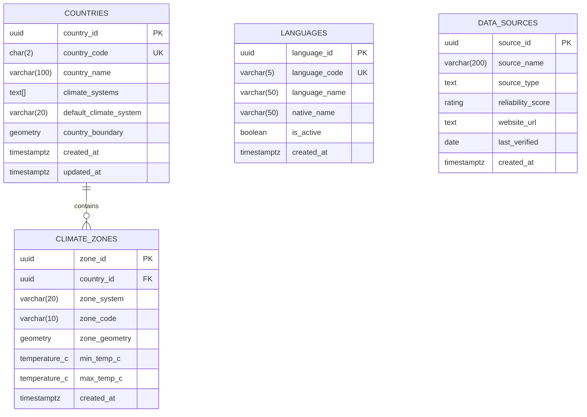
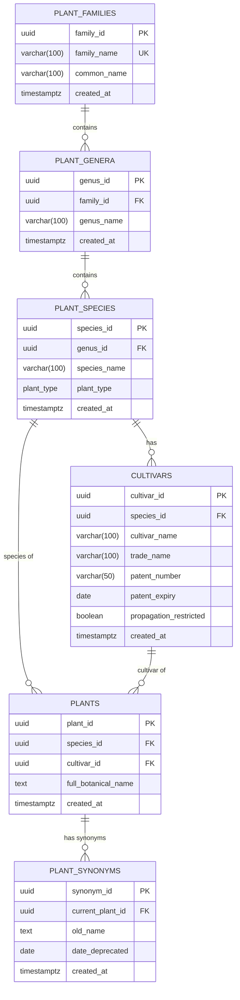
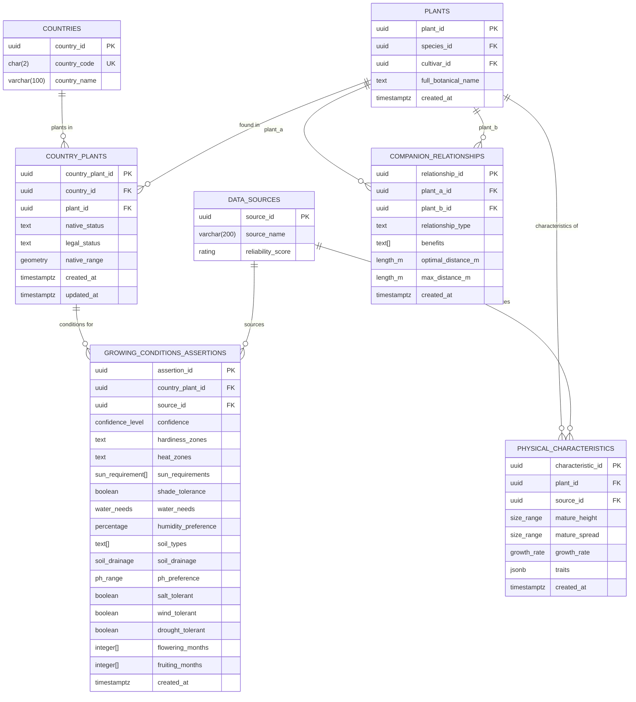
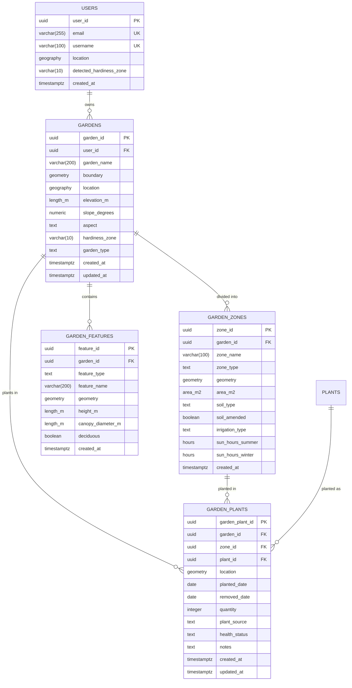

# Entity-Relationship Diagram

## Comprehensive Plant Database Schema

### Core Infrastructure Layer

### Plant Taxonomy Layer

### Plant Information Layer

### User Gardens Layer

## Key Relationships

### Primary Relationships
1. **Taxonomic Hierarchy**: Families → Genera → Species → Cultivars → Plants
2. **Geographic Context**: Countries → Climate Zones → Country Plants
3. **User Context**: Users → Gardens → Zones → Plant Placements
4. **Data Quality**: Data Sources → Growing Conditions & Physical Characteristics

### Spatial Relationships
- Countries have spatial boundaries (MultiPolygon)
- Climate zones have spatial geometry (MultiPolygon)
- Gardens have boundaries and locations (Polygon + Point)
- Garden zones have geometry (Polygon)
- Garden features have geometry (Point/Polygon)
- Plant placements have locations (Point)

### Constraints and Rules
1. **Unique Constraints**:
   - One cultivar per species with same name
   - One plant per species-cultivar combination
   - One country-plant combination per country

2. **Spatial Constraints**:
   - Garden zones must be within garden boundaries
   - Plant placements must be within zone boundaries

3. **Data Quality**:
   - Source reliability scoring (1-5 stars)
   - Confidence levels for growing conditions
   - Multiple sources can provide data for same plant

## Domain Types

### Measurement Domains
- `temperature_c`: -273.1 to 100.0°C
- `length_m`: Non-negative lengths in meters
- `area_m2`: Non-negative areas in square meters
- `percentage`: 0-100%
- `ph_value`: 0-14 pH scale
- `rating`: 1-5 star rating

### Composite Types
- `temp_range`: min, max, optimal temperatures
- `ph_range`: min, max, optimal pH values
- `size_range`: min, typical, max sizes

### Enum Types
- `plant_type`: tree, shrub, perennial, annual, etc.
- `confidence_level`: very_low to confirmed
- `sun_requirement`: full_sun to full_shade
- `water_needs`: very_dry to aquatic
- `soil_drainage`: very_well_drained to waterlogged
- `growth_rate`: very_slow to very_fast

## Indexes and Performance

### Spatial Indexes (GIST)
- Country boundaries
- Climate zone geometry
- Garden boundaries and locations
- Garden zone geometry
- Garden feature geometry
- Plant placement locations

### Text Search Indexes (GIN)
- Plant botanical names (full-text search)
- Physical characteristics traits (JSONB)

### Foreign Key Indexes
- All foreign key relationships for optimal join performance
- Critical for maintaining referential integrity at scale