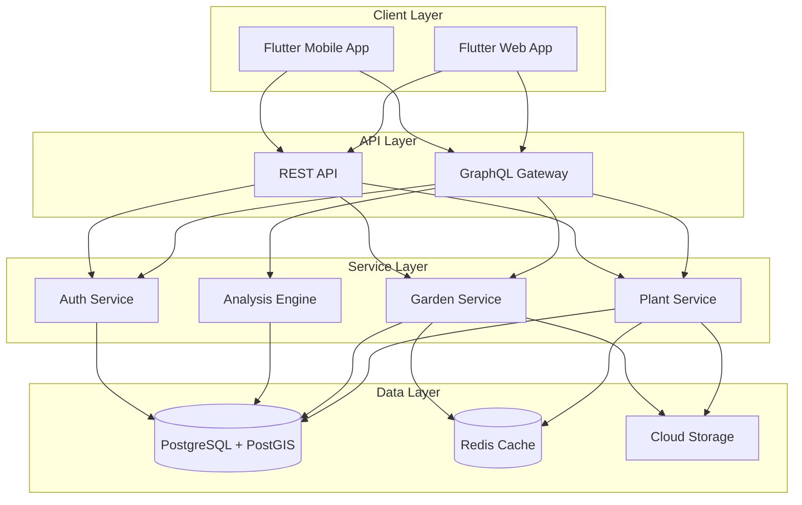

# Architecture Document
## Plant Database & Garden Management System

### System Overview



### Architecture Principles

1. **Separation of Concerns**: Each service has a single, well-defined responsibility
2. **Loose Coupling**: Services communicate through well-defined interfaces
3. **High Cohesion**: Related functionality grouped within services
4. **Scalability**: Horizontal scaling through Cloud Run
5. **Resilience**: Graceful degradation, circuit breakers, retries
6. **Security**: Defense in depth, least privilege access

### Component Architecture

#### 1. Database Layer

**PostgreSQL 17 with PostGIS**
```sql
-- Core spatial capabilities
- Geometric types (POINT, POLYGON, MULTIPOLYGON)
- Spatial indexes (GIST)
- Spatial functions (ST_Contains, ST_Distance, ST_Area)
- Topology support for zone relationships
```

**Schema Design Patterns**
- **Multi-source consensus**: Assertions table for conflicting data
- **Temporal data**: Planted/removed dates for garden history
- **Hierarchical data**: Plant taxonomy (family > genus > species)
- **Spatial indexing**: GIST indexes on all geometry columns
- **JSONB flexibility**: traits, uses, problems as JSONB

**Connection Strategy**
```go
- Connection pooling: 25 connections per service
- Read replicas: For analysis queries (future)
- Prepared statements: For common queries
- Transaction isolation: READ COMMITTED default
```

#### 2. Service Layer Architecture

**Domain-Driven Design**
```
service/
├── domain/           # Business logic
│   ├── entity/      # Domain models
│   ├── repository/  # Interfaces
│   └── service/     # Use cases
├── infrastructure/   # External dependencies
│   ├── database/    # PostgreSQL implementation
│   ├── cache/       # Redis implementation
│   └── storage/     # GCS implementation
└── interfaces/       # API contracts
    ├── http/        # REST handlers
    └── grpc/        # Internal communication
```

**Service Communication**
- **Synchronous**: gRPC for internal service calls
- **Asynchronous**: Pub/Sub for events (future)
- **Caching**: Redis for frequently accessed data
- **Circuit Breaker**: Prevent cascade failures

#### 3. API Layer Design

**GraphQL Gateway**
```graphql
# Aggregation layer for complex queries
- Single endpoint for all data needs
- Resolver pattern for data fetching
- DataLoader for N+1 prevention
- Subscription support for real-time updates
```

**REST API**
```yaml
# Simple CRUD operations
- /api/v1/plants - Plant operations
- /api/v1/gardens - Garden management
- /api/v1/auth - Authentication
- Health/Ready endpoints for monitoring
```

**API Patterns**
- **Versioning**: URL path versioning (/v1, /v2)
- **Pagination**: Cursor-based for large datasets
- **Filtering**: Query parameters for REST, arguments for GraphQL
- **Rate Limiting**: Token bucket algorithm
- **Authentication**: Firebase JWT validation

#### 4. Spatial Architecture

**PostGIS Integration**
```sql
-- Spatial operations executed in database
SELECT 
    z.id,
    z.name,
    ST_Area(z.geometry::geography) as area_m2,
    ST_AsGeoJSON(z.geometry) as geojson
FROM garden_zones z
WHERE ST_Contains(
    g.boundary, 
    z.geometry
)
```

**Spatial Processing Pipeline**
1. **Input**: GeoJSON from client
2. **Validation**: Polygon closure, self-intersection
3. **Storage**: PostGIS geometry type
4. **Analysis**: Spatial SQL functions
5. **Output**: GeoJSON or simplified format

**Coordinate System**
- **Storage**: WGS84 (SRID 4326)
- **Calculations**: Local projected system
- **Display**: Web Mercator for maps

#### 5. Analysis Engine Architecture

**Shade Calculation**
```python
Algorithm:
1. Get sun position for date/time/location
2. Project shadows from features (trees, buildings)
3. Calculate intersection with garden zones
4. Aggregate shade hours over day/season
```

**Drainage Analysis**
```python
Algorithm:
1. Create elevation raster from slope data
2. Calculate flow direction (D8 algorithm)
3. Accumulate flow
4. Identify sink points (frost pockets)
```

**Recommendation Engine**
```python
Factors:
- Climate zone match
- Sun requirements vs available
- Water needs vs drainage
- Companion relationships
- Space requirements
```

### Data Flow Patterns

#### Plant Search Flow
```
Client → GraphQL → Plant Service → PostgreSQL (FTS)
                                 ↓
                          Redis Cache (if hit)
```

#### Garden Creation Flow
```
Client → REST API → Garden Service → PostGIS (validate)
                                   ↓
                                PostgreSQL (store)
                                   ↓
                              Pub/Sub (notify analysis)
```

#### Analysis Request Flow
```
Client → GraphQL → Analysis Service → Load Garden
                                    ↓
                              Run Algorithms
                                    ↓
                              Cache Results
                                    ↓
                              Return Data
```

### Deployment Architecture

#### Google Cloud Platform
```yaml
Compute:
  - Cloud Run: Serverless containers
  - Cloud Build: CI/CD pipeline
  
Storage:
  - Cloud SQL: PostgreSQL database
  - Cloud Storage: Images and files
  - Memorystore: Redis cache
  
Network:
  - Cloud Load Balancer: Traffic distribution
  - Cloud CDN: Static content delivery
  - Cloud Armor: DDoS protection
  
Security:
  - Secret Manager: Credentials
  - IAM: Service accounts
  - VPC: Network isolation
```

#### Container Strategy
```dockerfile
# Multi-stage builds for minimal images
# Distroless base images for security
# Non-root user execution
# Health check endpoints
```

#### Scaling Strategy
- **Horizontal**: Cloud Run autoscaling (0-100 instances)
- **Vertical**: Configurable CPU/memory limits
- **Database**: Read replicas for analysis queries
- **Caching**: Redis for hot data
- **CDN**: Images and static assets

### Security Architecture

#### Authentication & Authorization
```
Firebase Auth → JWT Token → API Gateway → Service
                          ↓
                    Validate & Extract Claims
                          ↓
                    Check Permissions
```

#### Data Security
- **Encryption at Rest**: Cloud SQL automatic
- **Encryption in Transit**: TLS 1.3
- **Secrets Management**: Google Secret Manager
- **API Security**: Rate limiting, CORS, CSP headers

#### Workspace Isolation
```sql
-- Row Level Security
CREATE POLICY workspace_isolation ON gardens
    FOR ALL
    USING (workspace_id = current_setting('app.workspace_id'));
```

### Performance Optimizations

#### Database
- Prepared statements for common queries
- Connection pooling (25 per service)
- Spatial indexes on geometry columns
- Materialized views for complex aggregations
- Partitioning for large tables (future)

#### Caching Strategy
```
L1 Cache: Application memory (5 min TTL)
L2 Cache: Redis (1 hour TTL)
L3 Cache: CDN (24 hour TTL for images)
```

#### Query Optimization
- GraphQL DataLoader for batching
- Projection pushdown (select only needed fields)
- Pagination for large result sets
- Async processing for analysis

### Monitoring & Observability

#### Metrics
- **Golden Signals**: Latency, Traffic, Errors, Saturation
- **Business Metrics**: Gardens created, plants added, searches
- **Custom Metrics**: Spatial query time, analysis duration

#### Logging
```json
{
  "timestamp": "2024-01-01T12:00:00Z",
  "level": "INFO",
  "service": "plant-api",
  "trace_id": "abc123",
  "message": "Plant search completed",
  "duration_ms": 45,
  "result_count": 10
}
```

#### Tracing
- Distributed tracing with OpenTelemetry
- Trace ID propagation across services
- Span attributes for debugging

### Disaster Recovery

#### Backup Strategy
- **Database**: Daily automated backups, 30-day retention
- **Point-in-time**: 7-day recovery window
- **Images**: Cloud Storage versioning
- **Configuration**: Git repository

#### Failure Scenarios
1. **Database failure**: Failover to replica
2. **Service failure**: Cloud Run auto-restart
3. **Region failure**: Multi-region setup (future)
4. **Data corruption**: Point-in-time recovery

### Technology Decisions

| Component | Technology     | Rationale                      |
| --------- | -------------- | ------------------------------ |
| Database  | PostgreSQL 17  | PostGIS support, maturity      |
| Spatial   | PostGIS 3.4    | Industry standard, performance |
| Backend   | Go 1.21        | Performance, concurrency       |
| API       | GraphQL + REST | Flexibility + simplicity       |
| Cache     | Redis 7        | Performance, pub/sub           |
| Auth      | Firebase       | Managed service, scalability   |
| Frontend  | Flutter        | Cross-platform, performance    |
| Cloud     | GCP            | Integration, pricing           |

### Future Architecture Considerations

#### Phase 2 Enhancements
- Event-driven architecture with Pub/Sub
- Microservices mesh with Istio
- Read replicas for analysis
- Multi-region deployment

#### Phase 3 Scaling
- CQRS for read/write separation
- Event sourcing for garden history
- GraphQL federation
- Edge computing for analysis

### Architecture Decision Records (ADRs)

#### ADR-001: PostgreSQL over NoSQL
**Decision**: Use PostgreSQL with PostGIS
**Rationale**: Spatial queries require PostGIS, relational data model fits domain

#### ADR-002: GraphQL for complex queries
**Decision**: GraphQL for reads, REST for writes
**Rationale**: Complex nested queries benefit from GraphQL, simple CRUD suits REST

#### ADR-003: Monorepo structure
**Decision**: Single repository for all services
**Rationale**: Easier dependency management, atomic commits across services

#### ADR-004: Cloud Run over Kubernetes
**Decision**: Use Cloud Run for container hosting
**Rationale**: Serverless scaling, reduced operational overhead